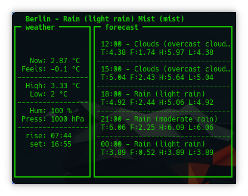

# GOWEATHERTUI

[](https://github.com/dragonchaser/goweathertui/actions?workflow=CI)



Goweathertui is a small text ui for displaying weatherforcastes based on [openweathermap](https://openweathermap.org/).

It utilizes [https://github.com/briandowns/openweathermap](https://github.com/briandowns/openweathermap) and [https://github.com/gizak/termui](https://github.com/gizak/termui).

## Building

```bash
$> git clone https://github.com/dragonchaser/goweathertui
$> make
```

## Running

To run it you need to get an api key from [openweathermap](https://openweathermap.org/) and export it as environment variable

```bash
export OWM_API_KEY=<your open weathermap api key>
```

To set your location you also have to export the following variables (adapt to your needs):

```bash
export WEATHER_LOCATION_ZIP=10115
export WEATHER_LOCALE=en
export WEATHER_COUNTRY_CODE=de
```
